# Executive Summary

This report presents benchmark timing results comparing three Bayesian
structural equation modeling software packages:

- **Blimp** (via rblimp)
- **blavaan** (Bayesian lavaan)
- **Mplus** (Bayes estimator, via MplusAutomation)

``` r
# Load benchmark results
results <- readRDS('benchmark_results.rds')

# Extract session info from benchmark run
benchmark_session_info <- attr(results, "session_info")
benchmark_date <- attr(results, "benchmark_date")

# Order results by model number
model_order <- c("model1", "model2", "model3", "model5", "model6",
                 "model13", "model14", "model17", "model20", "model21")
results <- results[model_order[model_order %in% names(results)]]

# Get number of replications from first model
n_replications <- summary(results[[1]]) |> as.data.frame() |> subset(select = neval) |> unique() |> as.numeric()
```

Each model was estimated **10 times** per software package using the
`microbenchmark` package. All models used **2 processors** for parallel
chain execution. MCMC settings vary by model complexity (see table below
for details).

``` r
# Model information
model_info <- data.frame(
  model = c("Model 1", "Model 2", "Model 3", "Model 5", "Model 6",
            "Model 13", "Model 14", "Model 17", "Model 20", "Model 21"),
  description = c(
    "Normal outcome, latent predictor",
    "Normal outcome, latent mediator",
    "Correlated latent/manifest predictors",
    "Ordinal indicators, latent response variable",
    "Multicategorical predictor, ordinal indicators",
    "Growth model with AR(1) residuals",
    "Sum score model",
    "Two-level random slope model",
    "Two-part outcome model",
    "Random intercept cross-lagged panel (RI-CLPM)"
  ),
  blimp_mplus = c(
    "2 chains, burn=10000, 10000 per chain",
    "2 chains, burn=10000, 10000 per chain",
    "2 chains, burn=10000, 10000 per chain",
    "2 chains, burn=20000, 20000 per chain",
    "2 chains, burn=10000, 10000 per chain",
    "2 chains, burn=20000, 20000 per chain",
    "2 chains, burn=10000, 10000 per chain",
    "2 chains, burn=10000, 10000 per chain",
    "2 chains, burn=10000, 10000 per chain",
    "2 chains, burn=20000, 20000 per chain"
  ),
  blavaan = c(
    "2 chains, burn=500, 1000 per chain",
    "2 chains, burn=500, 1000 per chain",
    "2 chains, burn=500, 1000 per chain",
    "2 chains, burn=500, 1000 per chain",
    "2 chains, burn=500, 1000 per chain",
    "—",
    "2 chains, burn=500, 1000 per chain",
    "—",
    "2 chains, burn=500, 1000 per chain",
    "—"
  ),
  software = c(
    "Blimp, blavaan, Mplus",
    "Blimp, blavaan, Mplus",
    "Blimp, blavaan, Mplus",
    "Blimp, blavaan, Mplus",
    "Blimp, blavaan, Mplus",
    "Blimp, Mplus",
    "Blimp, blavaan, Mplus",
    "Blimp, Mplus",
    "Blimp, blavaan, Mplus",
    "Blimp, Mplus"
  )
)
```

## Model Summary

``` r
kable(model_info,
      col.names = c("Model", "Description", "Blimp/Mplus MCMC", "blavaan MCMC", "Software Tested"),
      caption = "Models included in benchmark comparison") %>%
  kable_styling(bootstrap_options = c("striped", "hover", "condensed"),
                full_width = FALSE)
```

<table class="table table-striped table-hover table-condensed" style="width: auto !important; margin-left: auto; margin-right: auto;">

<caption>

Models included in benchmark comparison
</caption>

<thead>

<tr>

<th style="text-align:left;">

Model
</th>

<th style="text-align:left;">

Description
</th>

<th style="text-align:left;">

Blimp/Mplus MCMC
</th>

<th style="text-align:left;">

blavaan MCMC
</th>

<th style="text-align:left;">

Software Tested
</th>

</tr>

</thead>

<tbody>

<tr>

<td style="text-align:left;">

Model 1
</td>

<td style="text-align:left;">

Normal outcome, latent predictor
</td>

<td style="text-align:left;">

2 chains, burn=10000, 10000 per chain
</td>

<td style="text-align:left;">

2 chains, burn=500, 1000 per chain
</td>

<td style="text-align:left;">

Blimp, blavaan, Mplus
</td>

</tr>

<tr>

<td style="text-align:left;">

Model 2
</td>

<td style="text-align:left;">

Normal outcome, latent mediator
</td>

<td style="text-align:left;">

2 chains, burn=10000, 10000 per chain
</td>

<td style="text-align:left;">

2 chains, burn=500, 1000 per chain
</td>

<td style="text-align:left;">

Blimp, blavaan, Mplus
</td>

</tr>

<tr>

<td style="text-align:left;">

Model 3
</td>

<td style="text-align:left;">

Correlated latent/manifest predictors
</td>

<td style="text-align:left;">

2 chains, burn=10000, 10000 per chain
</td>

<td style="text-align:left;">

2 chains, burn=500, 1000 per chain
</td>

<td style="text-align:left;">

Blimp, blavaan, Mplus
</td>

</tr>

<tr>

<td style="text-align:left;">

Model 5
</td>

<td style="text-align:left;">

Ordinal indicators, latent response variable
</td>

<td style="text-align:left;">

2 chains, burn=20000, 20000 per chain
</td>

<td style="text-align:left;">

2 chains, burn=500, 1000 per chain
</td>

<td style="text-align:left;">

Blimp, blavaan, Mplus
</td>

</tr>

<tr>

<td style="text-align:left;">

Model 6
</td>

<td style="text-align:left;">

Multicategorical predictor, ordinal indicators
</td>

<td style="text-align:left;">

2 chains, burn=10000, 10000 per chain
</td>

<td style="text-align:left;">

2 chains, burn=500, 1000 per chain
</td>

<td style="text-align:left;">

Blimp, blavaan, Mplus
</td>

</tr>

<tr>

<td style="text-align:left;">

Model 13
</td>

<td style="text-align:left;">

Growth model with AR(1) residuals
</td>

<td style="text-align:left;">

2 chains, burn=20000, 20000 per chain
</td>

<td style="text-align:left;">

—
</td>

<td style="text-align:left;">

Blimp, Mplus
</td>

</tr>

<tr>

<td style="text-align:left;">

Model 14
</td>

<td style="text-align:left;">

Sum score model
</td>

<td style="text-align:left;">

2 chains, burn=10000, 10000 per chain
</td>

<td style="text-align:left;">

2 chains, burn=500, 1000 per chain
</td>

<td style="text-align:left;">

Blimp, blavaan, Mplus
</td>

</tr>

<tr>

<td style="text-align:left;">

Model 17
</td>

<td style="text-align:left;">

Two-level random slope model
</td>

<td style="text-align:left;">

2 chains, burn=10000, 10000 per chain
</td>

<td style="text-align:left;">

—
</td>

<td style="text-align:left;">

Blimp, Mplus
</td>

</tr>

<tr>

<td style="text-align:left;">

Model 20
</td>

<td style="text-align:left;">

Two-part outcome model
</td>

<td style="text-align:left;">

2 chains, burn=10000, 10000 per chain
</td>

<td style="text-align:left;">

2 chains, burn=500, 1000 per chain
</td>

<td style="text-align:left;">

Blimp, blavaan, Mplus
</td>

</tr>

<tr>

<td style="text-align:left;">

Model 21
</td>

<td style="text-align:left;">

Random intercept cross-lagged panel (RI-CLPM)
</td>

<td style="text-align:left;">

2 chains, burn=20000, 20000 per chain
</td>

<td style="text-align:left;">

—
</td>

<td style="text-align:left;">

Blimp, Mplus
</td>

</tr>

</tbody>

</table>

# Summary of Results

``` r
# Create summary table
summary_list <- lapply(names(results), function(model_name) {
  result <- results[[model_name]]
  summary_df <- summary(result)
  summary_df$model <- model_name
  return(summary_df)
})

summary_table <- do.call(rbind, summary_list)

# Convert to data frame and ensure numeric columns (already in seconds)
summary_table <- as.data.frame(summary_table)

# Set factor levels to maintain order
summary_table$model <- factor(summary_table$model, levels = names(results))

# Get all models and software combinations to identify missing ones
all_models <- unique(summary_table$model)
all_software <- c("blimp", "mplus", "blavaan")

# Create complete grid
complete_grid <- expand.grid(
  model = all_models,
  expr = all_software,
  stringsAsFactors = FALSE
)

# Create comprehensive table with speed ratios
combined_stats <- summary_table %>%
  select(model, expr, mean, median) %>%
  mutate(
    mean = as.numeric(mean),
    median = as.numeric(median)
  )

# Merge with complete grid to add missing combinations
combined_stats <- complete_grid %>%
  left_join(combined_stats, by = c("model", "expr")) %>%
  arrange(model, expr) %>%
  group_by(model) %>%
  mutate(
    min_time = min(median, na.rm = TRUE),
    ratio = ifelse(is.na(median), NA, median / min_time),
    fastest = ifelse(!is.na(median) & median == min_time, "✓", "")
  ) %>%
  ungroup() %>%
  mutate(
    mean = ifelse(is.na(mean), "—", sprintf("%.2f", mean)),
    median = ifelse(is.na(median), "—", sprintf("%.2f", median)),
    ratio = ifelse(is.na(ratio), "—", sprintf("%.2f", ratio))
  ) %>%
  select(model, expr, mean, median, ratio, fastest)

# Ensure ordering by model first, then software
combined_stats$model <- factor(combined_stats$model, levels = names(results))
combined_stats <- combined_stats %>% arrange(model, expr)

kable(combined_stats,
      col.names = c("Model", "Software", "Mean (s)", "Median (s)",
                    "Ratio", "Fastest?"),
      caption = paste("Timing statistics and speed ratios across", n_replications, "runs per software"),
      align = c("l", "l", "r", "r", "r", "c"),
      row.names = FALSE) %>%
  kable_styling(bootstrap_options = c("striped", "hover", "condensed")) %>%
  collapse_rows(columns = 1, valign = "top") %>%
  row_spec(which(combined_stats$model != dplyr::lag(combined_stats$model, default = factor(NA, levels = levels(combined_stats$model)))),
           extra_css = "border-top: 2px solid #000;")
```

<table class="table table-striped table-hover table-condensed" style="margin-left: auto; margin-right: auto;">

<caption>

Timing statistics and speed ratios across 10 runs per software
</caption>

<thead>

<tr>

<th style="text-align:left;">

Model
</th>

<th style="text-align:left;">

Software
</th>

<th style="text-align:right;">

Mean (s)
</th>

<th style="text-align:right;">

Median (s)
</th>

<th style="text-align:right;">

Ratio
</th>

<th style="text-align:center;">

Fastest?
</th>

</tr>

</thead>

<tbody>

<tr>

<td style="text-align:left;vertical-align: top !important;" rowspan="3">

model1
</td>

<td style="text-align:left;">

blavaan
</td>

<td style="text-align:right;">

2.15
</td>

<td style="text-align:right;">

2.16
</td>

<td style="text-align:right;">

1.00
</td>

<td style="text-align:center;">

✓
</td>

</tr>

<tr>

<td style="text-align:left;">

blimp
</td>

<td style="text-align:right;">

6.06
</td>

<td style="text-align:right;">

6.07
</td>

<td style="text-align:right;">

2.82
</td>

<td style="text-align:center;">

</td>

</tr>

<tr>

<td style="text-align:left;">

mplus
</td>

<td style="text-align:right;">

5.11
</td>

<td style="text-align:right;">

5.11
</td>

<td style="text-align:right;">

2.37
</td>

<td style="text-align:center;">

</td>

</tr>

<tr>

<td style="text-align:left;vertical-align: top !important;border-top: 2px solid #000;" rowspan="3">

model2
</td>

<td style="text-align:left;border-top: 2px solid #000;">

blavaan
</td>

<td style="text-align:right;border-top: 2px solid #000;">

2.80
</td>

<td style="text-align:right;border-top: 2px solid #000;">

2.79
</td>

<td style="text-align:right;border-top: 2px solid #000;">

1.00
</td>

<td style="text-align:center;border-top: 2px solid #000;">

✓
</td>

</tr>

<tr>

<td style="text-align:left;">

blimp
</td>

<td style="text-align:right;">

6.92
</td>

<td style="text-align:right;">

6.92
</td>

<td style="text-align:right;">

2.48
</td>

<td style="text-align:center;">

</td>

</tr>

<tr>

<td style="text-align:left;">

mplus
</td>

<td style="text-align:right;">

6.26
</td>

<td style="text-align:right;">

6.26
</td>

<td style="text-align:right;">

2.25
</td>

<td style="text-align:center;">

</td>

</tr>

<tr>

<td style="text-align:left;vertical-align: top !important;border-top: 2px solid #000;" rowspan="3">

model3
</td>

<td style="text-align:left;border-top: 2px solid #000;">

blavaan
</td>

<td style="text-align:right;border-top: 2px solid #000;">

2.59
</td>

<td style="text-align:right;border-top: 2px solid #000;">

2.59
</td>

<td style="text-align:right;border-top: 2px solid #000;">

1.00
</td>

<td style="text-align:center;border-top: 2px solid #000;">

✓
</td>

</tr>

<tr>

<td style="text-align:left;">

blimp
</td>

<td style="text-align:right;">

9.03
</td>

<td style="text-align:right;">

9.06
</td>

<td style="text-align:right;">

3.49
</td>

<td style="text-align:center;">

</td>

</tr>

<tr>

<td style="text-align:left;">

mplus
</td>

<td style="text-align:right;">

5.81
</td>

<td style="text-align:right;">

5.82
</td>

<td style="text-align:right;">

2.24
</td>

<td style="text-align:center;">

</td>

</tr>

<tr>

<td style="text-align:left;vertical-align: top !important;border-top: 2px solid #000;" rowspan="3">

model5
</td>

<td style="text-align:left;border-top: 2px solid #000;">

blavaan
</td>

<td style="text-align:right;border-top: 2px solid #000;">

125.36
</td>

<td style="text-align:right;border-top: 2px solid #000;">

133.46
</td>

<td style="text-align:right;border-top: 2px solid #000;">

4.44
</td>

<td style="text-align:center;border-top: 2px solid #000;">

</td>

</tr>

<tr>

<td style="text-align:left;">

blimp
</td>

<td style="text-align:right;">

30.13
</td>

<td style="text-align:right;">

30.06
</td>

<td style="text-align:right;">

1.00
</td>

<td style="text-align:center;">

✓
</td>

</tr>

<tr>

<td style="text-align:left;">

mplus
</td>

<td style="text-align:right;">

81.38
</td>

<td style="text-align:right;">

81.38
</td>

<td style="text-align:right;">

2.71
</td>

<td style="text-align:center;">

</td>

</tr>

<tr>

<td style="text-align:left;vertical-align: top !important;border-top: 2px solid #000;" rowspan="3">

model6
</td>

<td style="text-align:left;border-top: 2px solid #000;">

blavaan
</td>

<td style="text-align:right;border-top: 2px solid #000;">

117.69
</td>

<td style="text-align:right;border-top: 2px solid #000;">

116.82
</td>

<td style="text-align:right;border-top: 2px solid #000;">

9.17
</td>

<td style="text-align:center;border-top: 2px solid #000;">

</td>

</tr>

<tr>

<td style="text-align:left;">

blimp
</td>

<td style="text-align:right;">

12.76
</td>

<td style="text-align:right;">

12.74
</td>

<td style="text-align:right;">

1.00
</td>

<td style="text-align:center;">

✓
</td>

</tr>

<tr>

<td style="text-align:left;">

mplus
</td>

<td style="text-align:right;">

37.07
</td>

<td style="text-align:right;">

36.95
</td>

<td style="text-align:right;">

2.90
</td>

<td style="text-align:center;">

</td>

</tr>

<tr>

<td style="text-align:left;vertical-align: top !important;border-top: 2px solid #000;" rowspan="3">

model13
</td>

<td style="text-align:left;border-top: 2px solid #000;">

blavaan
</td>

<td style="text-align:right;border-top: 2px solid #000;">

—
</td>

<td style="text-align:right;border-top: 2px solid #000;">

—
</td>

<td style="text-align:right;border-top: 2px solid #000;">

—
</td>

<td style="text-align:center;border-top: 2px solid #000;">

</td>

</tr>

<tr>

<td style="text-align:left;">

blimp
</td>

<td style="text-align:right;">

21.11
</td>

<td style="text-align:right;">

20.97
</td>

<td style="text-align:right;">

1.19
</td>

<td style="text-align:center;">

</td>

</tr>

<tr>

<td style="text-align:left;">

mplus
</td>

<td style="text-align:right;">

17.71
</td>

<td style="text-align:right;">

17.69
</td>

<td style="text-align:right;">

1.00
</td>

<td style="text-align:center;">

✓
</td>

</tr>

<tr>

<td style="text-align:left;vertical-align: top !important;border-top: 2px solid #000;" rowspan="3">

model14
</td>

<td style="text-align:left;border-top: 2px solid #000;">

blavaan
</td>

<td style="text-align:right;border-top: 2px solid #000;">

1.47
</td>

<td style="text-align:right;border-top: 2px solid #000;">

1.45
</td>

<td style="text-align:right;border-top: 2px solid #000;">

1.48
</td>

<td style="text-align:center;border-top: 2px solid #000;">

</td>

</tr>

<tr>

<td style="text-align:left;">

blimp
</td>

<td style="text-align:right;">

1.82
</td>

<td style="text-align:right;">

1.82
</td>

<td style="text-align:right;">

1.86
</td>

<td style="text-align:center;">

</td>

</tr>

<tr>

<td style="text-align:left;">

mplus
</td>

<td style="text-align:right;">

0.97
</td>

<td style="text-align:right;">

0.98
</td>

<td style="text-align:right;">

1.00
</td>

<td style="text-align:center;">

✓
</td>

</tr>

<tr>

<td style="text-align:left;vertical-align: top !important;border-top: 2px solid #000;" rowspan="3">

model17
</td>

<td style="text-align:left;border-top: 2px solid #000;">

blavaan
</td>

<td style="text-align:right;border-top: 2px solid #000;">

—
</td>

<td style="text-align:right;border-top: 2px solid #000;">

—
</td>

<td style="text-align:right;border-top: 2px solid #000;">

—
</td>

<td style="text-align:center;border-top: 2px solid #000;">

</td>

</tr>

<tr>

<td style="text-align:left;">

blimp
</td>

<td style="text-align:right;">

16.10
</td>

<td style="text-align:right;">

16.09
</td>

<td style="text-align:right;">

1.00
</td>

<td style="text-align:center;">

✓
</td>

</tr>

<tr>

<td style="text-align:left;">

mplus
</td>

<td style="text-align:right;">

165.81
</td>

<td style="text-align:right;">

165.82
</td>

<td style="text-align:right;">

10.30
</td>

<td style="text-align:center;">

</td>

</tr>

<tr>

<td style="text-align:left;vertical-align: top !important;border-top: 2px solid #000;" rowspan="3">

model20
</td>

<td style="text-align:left;border-top: 2px solid #000;">

blavaan
</td>

<td style="text-align:right;border-top: 2px solid #000;">

117.59
</td>

<td style="text-align:right;border-top: 2px solid #000;">

115.01
</td>

<td style="text-align:right;border-top: 2px solid #000;">

7.54
</td>

<td style="text-align:center;border-top: 2px solid #000;">

</td>

</tr>

<tr>

<td style="text-align:left;">

blimp
</td>

<td style="text-align:right;">

15.26
</td>

<td style="text-align:right;">

15.26
</td>

<td style="text-align:right;">

1.00
</td>

<td style="text-align:center;">

✓
</td>

</tr>

<tr>

<td style="text-align:left;">

mplus
</td>

<td style="text-align:right;">

—
</td>

<td style="text-align:right;">

—
</td>

<td style="text-align:right;">

—
</td>

<td style="text-align:center;">

</td>

</tr>

<tr>

<td style="text-align:left;vertical-align: top !important;border-top: 2px solid #000;" rowspan="3">

model21
</td>

<td style="text-align:left;border-top: 2px solid #000;">

blavaan
</td>

<td style="text-align:right;border-top: 2px solid #000;">

—
</td>

<td style="text-align:right;border-top: 2px solid #000;">

—
</td>

<td style="text-align:right;border-top: 2px solid #000;">

—
</td>

<td style="text-align:center;border-top: 2px solid #000;">

</td>

</tr>

<tr>

<td style="text-align:left;">

blimp
</td>

<td style="text-align:right;">

48.79
</td>

<td style="text-align:right;">

47.98
</td>

<td style="text-align:right;">

2.35
</td>

<td style="text-align:center;">

</td>

</tr>

<tr>

<td style="text-align:left;">

mplus
</td>

<td style="text-align:right;">

20.50
</td>

<td style="text-align:right;">

20.43
</td>

<td style="text-align:right;">

1.00
</td>

<td style="text-align:center;">

✓
</td>

</tr>

</tbody>

</table>

## Overall Performance Comparison

``` r
# Calculate overall average performance across all models
overall_performance <- summary_table %>%
  mutate(
    median = as.numeric(median),
    mean = as.numeric(mean)
  ) %>%
  group_by(expr) %>%
  summarize(
    mean_median = mean(median),
    mean_mean = mean(mean),
    total_time = sum(median)
  ) %>%
  arrange(mean_median)

kable(overall_performance,
      col.names = c("Software", "Avg Median (s)", "Avg Mean (s)", "Total Time (s)"),
      caption = "Overall performance across all models",
      digits = 1) %>%
  kable_styling(bootstrap_options = c("striped", "hover", "condensed"), full_width = FALSE)
```

<table class="table table-striped table-hover table-condensed" style="width: auto !important; margin-left: auto; margin-right: auto;">

<caption>

Overall performance across all models
</caption>

<thead>

<tr>

<th style="text-align:left;">

Software
</th>

<th style="text-align:right;">

Avg Median (s)
</th>

<th style="text-align:right;">

Avg Mean (s)
</th>

<th style="text-align:right;">

Total Time (s)
</th>

</tr>

</thead>

<tbody>

<tr>

<td style="text-align:left;">

blimp
</td>

<td style="text-align:right;">

16.7
</td>

<td style="text-align:right;">

16.8
</td>

<td style="text-align:right;">

167.0
</td>

</tr>

<tr>

<td style="text-align:left;">

mplus
</td>

<td style="text-align:right;">

37.8
</td>

<td style="text-align:right;">

37.8
</td>

<td style="text-align:right;">

340.4
</td>

</tr>

<tr>

<td style="text-align:left;">

blavaan
</td>

<td style="text-align:right;">

53.5
</td>

<td style="text-align:right;">

52.8
</td>

<td style="text-align:right;">

374.3
</td>

</tr>

</tbody>

</table>

## All Three Software Comparison (Common Models Only)

``` r
# Identify models where all three software packages were tested
common_models_all3 <- summary_table %>%
  group_by(model) %>%
  summarize(n_software = n_distinct(expr)) %>%
  filter(n_software == 3) %>%
  pull(model)

# Calculate average performance for models with all three software
if (length(common_models_all3) > 0) {
  overall_all3 <- summary_table %>%
    filter(model %in% common_models_all3) %>%
    mutate(median = as.numeric(median)) %>%
    group_by(expr) %>%
    summarize(
      mean_median = mean(median),
      n_models = n()
    ) %>%
    arrange(mean_median)
}
```

**Models included (6):** model1, model2, model3, model5, model6, model14

``` r
if (length(common_models_all3) > 0) {
  kable(overall_all3,
        col.names = c("Software", "Avg Median (s)", "N Models"),
        caption = "Performance comparison for models all three packages can estimate",
        digits = 1) %>%
    kable_styling(bootstrap_options = c("striped", "hover", "condensed"), full_width = FALSE)
}
```

<table class="table table-striped table-hover table-condensed" style="width: auto !important; margin-left: auto; margin-right: auto;">

<caption>

Performance comparison for models all three packages can estimate
</caption>

<thead>

<tr>

<th style="text-align:left;">

Software
</th>

<th style="text-align:right;">

Avg Median (s)
</th>

<th style="text-align:right;">

N Models
</th>

</tr>

</thead>

<tbody>

<tr>

<td style="text-align:left;">

blimp
</td>

<td style="text-align:right;">

11.1
</td>

<td style="text-align:right;">

6
</td>

</tr>

<tr>

<td style="text-align:left;">

mplus
</td>

<td style="text-align:right;">

22.8
</td>

<td style="text-align:right;">

6
</td>

</tr>

<tr>

<td style="text-align:left;">

blavaan
</td>

<td style="text-align:right;">

43.2
</td>

<td style="text-align:right;">

6
</td>

</tr>

</tbody>

</table>

## Blimp vs. Mplus (Common Models)

``` r
# Identify models where both Blimp and Mplus were tested
common_models_blimp_mplus <- summary_table %>%
  filter(expr %in% c("blimp", "mplus")) %>%
  group_by(model) %>%
  summarize(n_software = n_distinct(expr)) %>%
  filter(n_software == 2) %>%
  pull(model)

# Calculate average performance
if (length(common_models_blimp_mplus) > 0) {
  overall_blimp_mplus <- summary_table %>%
    filter(model %in% common_models_blimp_mplus, expr %in% c("blimp", "mplus")) %>%
    mutate(median = as.numeric(median)) %>%
    group_by(expr) %>%
    summarize(
      mean_median = mean(median),
      n_models = n()
    ) %>%
    arrange(mean_median)
}
```

**Models included (9):** model1, model2, model3, model5, model6,
model13, model14, model17, model21

``` r
if (length(common_models_blimp_mplus) > 0) {
  kable(overall_blimp_mplus,
        col.names = c("Software", "Avg Median (s)", "N Models"),
        caption = "Blimp vs. Mplus performance comparison",
        digits = 1) %>%
    kable_styling(bootstrap_options = c("striped", "hover", "condensed"), full_width = FALSE)
}
```

<table class="table table-striped table-hover table-condensed" style="width: auto !important; margin-left: auto; margin-right: auto;">

<caption>

Blimp vs. Mplus performance comparison
</caption>

<thead>

<tr>

<th style="text-align:left;">

Software
</th>

<th style="text-align:right;">

Avg Median (s)
</th>

<th style="text-align:right;">

N Models
</th>

</tr>

</thead>

<tbody>

<tr>

<td style="text-align:left;">

blimp
</td>

<td style="text-align:right;">

16.9
</td>

<td style="text-align:right;">

9
</td>

</tr>

<tr>

<td style="text-align:left;">

mplus
</td>

<td style="text-align:right;">

37.8
</td>

<td style="text-align:right;">

9
</td>

</tr>

</tbody>

</table>

## Blimp vs. blavaan (Common Models)

``` r
# Identify models where both Blimp and blavaan were tested
common_models_blimp_blavaan <- summary_table %>%
  filter(expr %in% c("blimp", "blavaan")) %>%
  group_by(model) %>%
  summarize(n_software = n_distinct(expr)) %>%
  filter(n_software == 2) %>%
  pull(model)

# Calculate average performance
if (length(common_models_blimp_blavaan) > 0) {
  overall_blimp_blavaan <- summary_table %>%
    filter(model %in% common_models_blimp_blavaan, expr %in% c("blimp", "blavaan")) %>%
    mutate(median = as.numeric(median)) %>%
    group_by(expr) %>%
    summarize(
      mean_median = mean(median),
      n_models = n()
    ) %>%
    arrange(mean_median)
}
```

**Models included (7):** model1, model2, model3, model5, model6,
model14, model20

``` r
if (length(common_models_blimp_blavaan) > 0) {
  kable(overall_blimp_blavaan,
        col.names = c("Software", "Avg Median (s)", "N Models"),
        caption = "Blimp vs. blavaan performance comparison",
        digits = 1) %>%
    kable_styling(bootstrap_options = c("striped", "hover", "condensed"), full_width = FALSE)
}
```

<table class="table table-striped table-hover table-condensed" style="width: auto !important; margin-left: auto; margin-right: auto;">

<caption>

Blimp vs. blavaan performance comparison
</caption>

<thead>

<tr>

<th style="text-align:left;">

Software
</th>

<th style="text-align:right;">

Avg Median (s)
</th>

<th style="text-align:right;">

N Models
</th>

</tr>

</thead>

<tbody>

<tr>

<td style="text-align:left;">

blimp
</td>

<td style="text-align:right;">

11.7
</td>

<td style="text-align:right;">

7
</td>

</tr>

<tr>

<td style="text-align:left;">

blavaan
</td>

<td style="text-align:right;">

53.5
</td>

<td style="text-align:right;">

7
</td>

</tr>

</tbody>

</table>

# Visualizations

## Boxplots by Model

``` r
# Create combined plot data
plot_data_list <- lapply(names(results), function(model_name) {
  result <- results[[model_name]]
  df <- as.data.frame(result)
  df$model <- model_name
  df$time <- df$time / 1e9  # Convert nanoseconds to seconds
  return(df)
})

plot_data <- do.call(rbind, plot_data_list)

# Set factor levels to maintain order
plot_data$model <- factor(plot_data$model, levels = names(results))

# Create faceted boxplot
ggplot(plot_data, aes(x = expr, y = time, fill = expr)) +
  geom_boxplot() +
  facet_wrap(~ model, scales = "free_y", ncol = 2) +
  labs(
    title = "Execution Time Distribution by Model and Software",
    subtitle = paste("Each box represents", n_replications, "runs"),
    x = "Software",
    y = "Time (seconds)",
    fill = "Software"
  ) +
  theme_minimal() +
  theme(
    axis.text.x = element_text(angle = 45, hjust = 1),
    legend.position = "bottom",
    strip.text = element_text(face = "bold")
  ) +
  scale_fill_manual(values = software_colors)
```

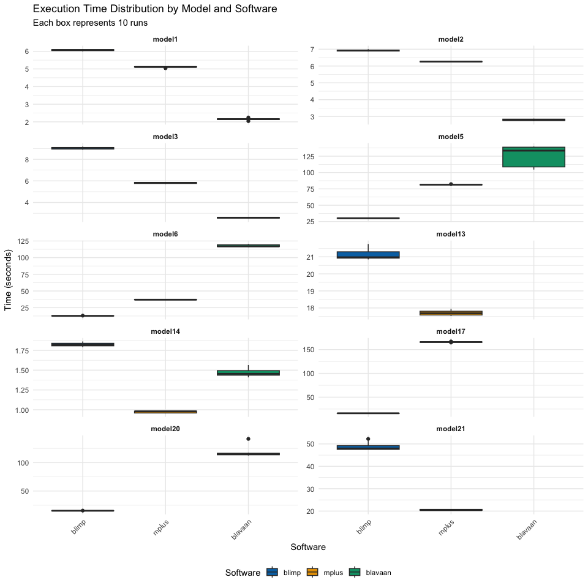<!-- -->

## Median Time Comparison Bar Chart

``` r
median_plot_data <- summary_table %>%
  mutate(median_seconds = as.numeric(median))

# Ensure model is a factor with correct order
median_plot_data$model <- factor(median_plot_data$model, levels = rev(names(results)))

ggplot(median_plot_data, aes(x = model, y = median_seconds, fill = expr)) +
  geom_bar(stat = "identity", position = "dodge") +
  labs(
    title = "Median Execution Time by Model and Software",
    x = "Model",
    y = "Median Time (seconds)",
    fill = "Software"
  ) +
  theme_minimal() +
  theme(
    axis.text.x = element_text(angle = 45, hjust = 1),
    legend.position = "bottom"
  ) +
  scale_fill_manual(values = software_colors) +
  coord_flip()
```

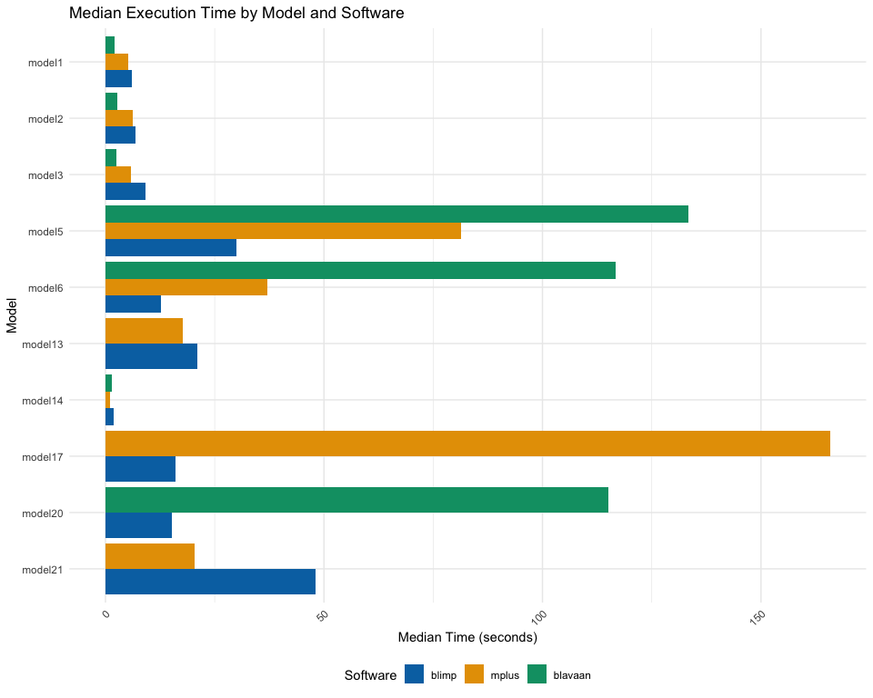<!-- -->

## Average Median Execution Time Across All Models

``` r
ggplot(overall_performance, aes(x = reorder(expr, mean_median), y = mean_median, fill = expr)) +
  geom_bar(stat = "identity") +
  labs(
    title = "Average Median Execution Time Across All Models",
    x = "Software",
    y = "Average Median Time (seconds)"
  ) +
  theme_minimal() +
  theme(legend.position = "none") +
  scale_fill_manual(values = software_colors) +
  coord_flip()
```

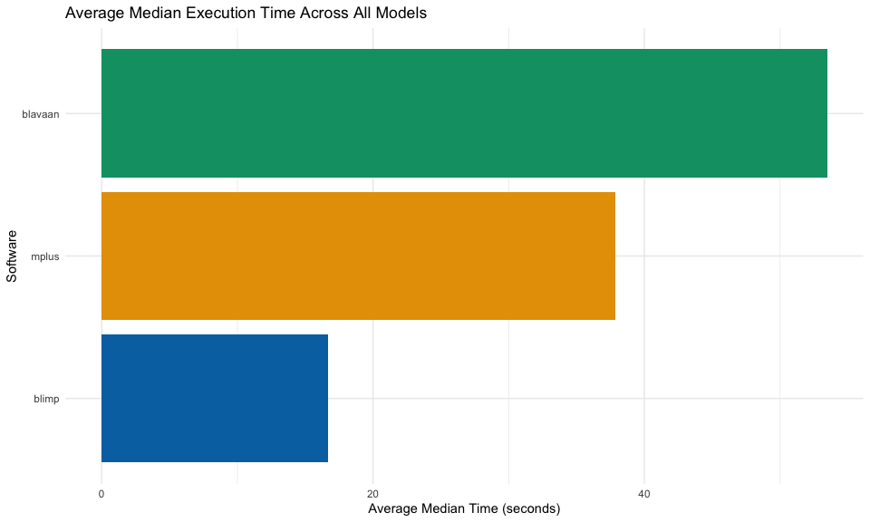<!-- -->

## All Three Software: Models in Common

``` r
if (length(common_models_all3) > 0) {
  ggplot(overall_all3, aes(x = reorder(expr, mean_median), y = mean_median, fill = expr)) +
    geom_bar(stat = "identity") +
    labs(
      title = "Average Median Time: Models All Three Can Estimate",
      subtitle = paste(length(common_models_all3), "models"),
      x = "Software",
      y = "Average Median Time (seconds)"
    ) +
    theme_minimal() +
    theme(legend.position = "none") +
    scale_fill_manual(values = software_colors) +
    coord_flip()
}
```

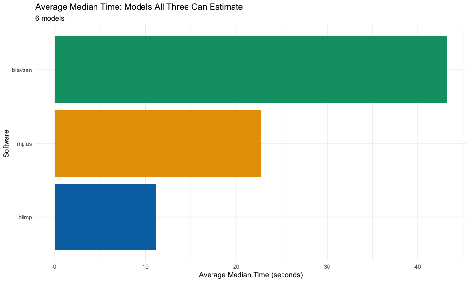<!-- -->

## Blimp vs. Mplus: Models in Common

``` r
if (length(common_models_blimp_mplus) > 0) {
  ggplot(overall_blimp_mplus, aes(x = reorder(expr, mean_median), y = mean_median, fill = expr)) +
    geom_bar(stat = "identity") +
    labs(
      title = "Average Median Time: Blimp vs. Mplus",
      subtitle = paste(length(common_models_blimp_mplus), "models"),
      x = "Software",
      y = "Average Median Time (seconds)"
    ) +
    theme_minimal() +
    theme(legend.position = "none") +
    scale_fill_manual(values = software_colors) +
    coord_flip()
}
```

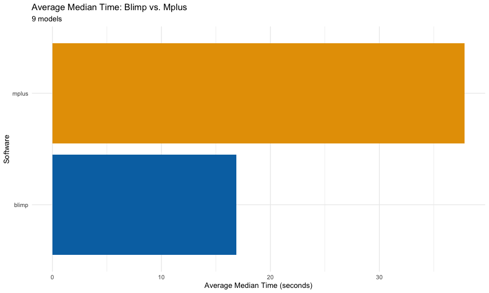<!-- -->

## Blimp vs. blavaan: Models in Common

``` r
if (length(common_models_blimp_blavaan) > 0) {
  ggplot(overall_blimp_blavaan, aes(x = reorder(expr, mean_median), y = mean_median, fill = expr)) +
    geom_bar(stat = "identity") +
    labs(
      title = "Average Median Time: Blimp vs. blavaan",
      subtitle = paste(length(common_models_blimp_blavaan), "models"),
      x = "Software",
      y = "Average Median Time (seconds)"
    ) +
    theme_minimal() +
    theme(legend.position = "none") +
    scale_fill_manual(values = software_colors) +
    coord_flip()
}
```

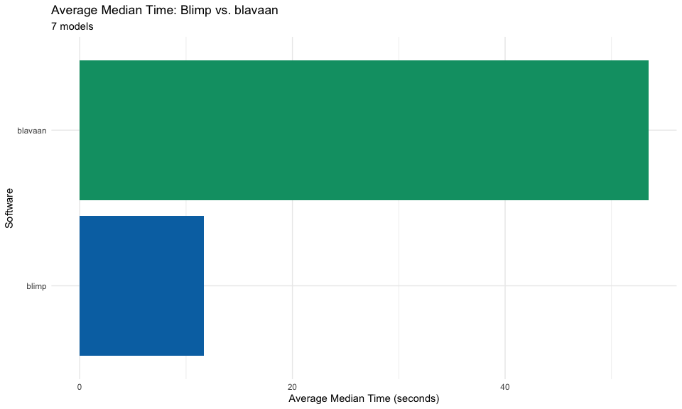<!-- -->

# Model-Specific Details

``` r
for (model_name in names(results)) {
  cat("\n##", toupper(model_name), "\n\n")

  result <- results[[model_name]]

  # Print summary
  cat("### Summary Statistics\n\n")
  print(kable(summary(result), digits = 2, caption = paste(model_name, "summary")) %>%
    kable_styling(bootstrap_options = c("striped", "hover", "condensed"), full_width = FALSE))

  # Create individual plot
  cat("\n### Distribution Plot\n\n")
  p <- autoplot(result, log = FALSE) +
    labs(title = paste(model_name, "Execution Time")) +
    theme_minimal()
  print(p)

  cat("\n\n---\n\n")
}
```

## MODEL1

### Summary Statistics

<table class="table table-striped table-hover table-condensed" style="width: auto !important; margin-left: auto; margin-right: auto;">

<caption>

model1 summary
</caption>

<thead>

<tr>

<th style="text-align:left;">

expr
</th>

<th style="text-align:right;">

min
</th>

<th style="text-align:right;">

lq
</th>

<th style="text-align:right;">

mean
</th>

<th style="text-align:right;">

median
</th>

<th style="text-align:right;">

uq
</th>

<th style="text-align:right;">

max
</th>

<th style="text-align:right;">

neval
</th>

</tr>

</thead>

<tbody>

<tr>

<td style="text-align:left;">

blimp
</td>

<td style="text-align:right;">

5.99
</td>

<td style="text-align:right;">

6.04
</td>

<td style="text-align:right;">

6.06
</td>

<td style="text-align:right;">

6.07
</td>

<td style="text-align:right;">

6.10
</td>

<td style="text-align:right;">

6.12
</td>

<td style="text-align:right;">

10
</td>

</tr>

<tr>

<td style="text-align:left;">

mplus
</td>

<td style="text-align:right;">

5.04
</td>

<td style="text-align:right;">

5.10
</td>

<td style="text-align:right;">

5.11
</td>

<td style="text-align:right;">

5.11
</td>

<td style="text-align:right;">

5.13
</td>

<td style="text-align:right;">

5.15
</td>

<td style="text-align:right;">

10
</td>

</tr>

<tr>

<td style="text-align:left;">

blavaan
</td>

<td style="text-align:right;">

2.04
</td>

<td style="text-align:right;">

2.13
</td>

<td style="text-align:right;">

2.15
</td>

<td style="text-align:right;">

2.16
</td>

<td style="text-align:right;">

2.17
</td>

<td style="text-align:right;">

2.25
</td>

<td style="text-align:right;">

10
</td>

</tr>

</tbody>

</table>

### Distribution Plot

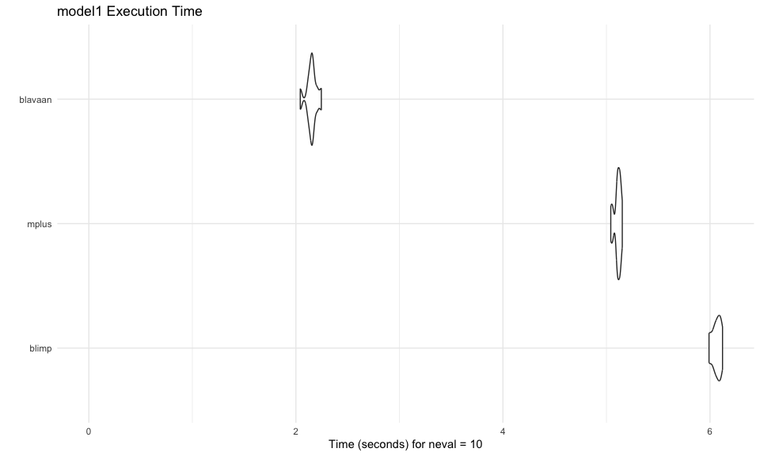<!-- -->

------------------------------------------------------------------------

## MODEL2

### Summary Statistics

<table class="table table-striped table-hover table-condensed" style="width: auto !important; margin-left: auto; margin-right: auto;">

<caption>

model2 summary
</caption>

<thead>

<tr>

<th style="text-align:left;">

expr
</th>

<th style="text-align:right;">

min
</th>

<th style="text-align:right;">

lq
</th>

<th style="text-align:right;">

mean
</th>

<th style="text-align:right;">

median
</th>

<th style="text-align:right;">

uq
</th>

<th style="text-align:right;">

max
</th>

<th style="text-align:right;">

neval
</th>

</tr>

</thead>

<tbody>

<tr>

<td style="text-align:left;">

blimp
</td>

<td style="text-align:right;">

6.86
</td>

<td style="text-align:right;">

6.89
</td>

<td style="text-align:right;">

6.92
</td>

<td style="text-align:right;">

6.92
</td>

<td style="text-align:right;">

6.95
</td>

<td style="text-align:right;">

7.00
</td>

<td style="text-align:right;">

10
</td>

</tr>

<tr>

<td style="text-align:left;">

mplus
</td>

<td style="text-align:right;">

6.23
</td>

<td style="text-align:right;">

6.25
</td>

<td style="text-align:right;">

6.26
</td>

<td style="text-align:right;">

6.26
</td>

<td style="text-align:right;">

6.27
</td>

<td style="text-align:right;">

6.29
</td>

<td style="text-align:right;">

10
</td>

</tr>

<tr>

<td style="text-align:left;">

blavaan
</td>

<td style="text-align:right;">

2.73
</td>

<td style="text-align:right;">

2.75
</td>

<td style="text-align:right;">

2.80
</td>

<td style="text-align:right;">

2.79
</td>

<td style="text-align:right;">

2.85
</td>

<td style="text-align:right;">

2.87
</td>

<td style="text-align:right;">

10
</td>

</tr>

</tbody>

</table>

### Distribution Plot

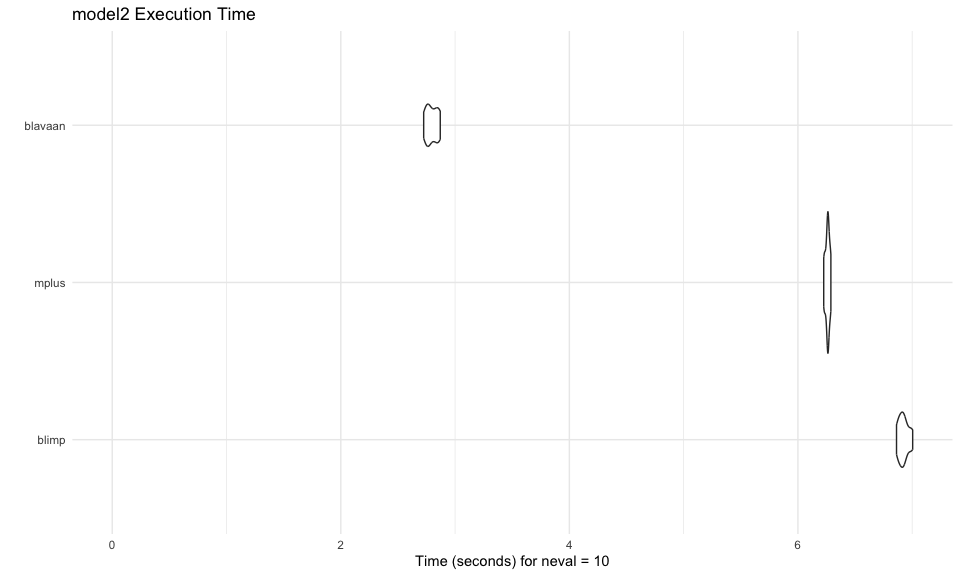<!-- -->

------------------------------------------------------------------------

## MODEL3

### Summary Statistics

<table class="table table-striped table-hover table-condensed" style="width: auto !important; margin-left: auto; margin-right: auto;">

<caption>

model3 summary
</caption>

<thead>

<tr>

<th style="text-align:left;">

expr
</th>

<th style="text-align:right;">

min
</th>

<th style="text-align:right;">

lq
</th>

<th style="text-align:right;">

mean
</th>

<th style="text-align:right;">

median
</th>

<th style="text-align:right;">

uq
</th>

<th style="text-align:right;">

max
</th>

<th style="text-align:right;">

neval
</th>

</tr>

</thead>

<tbody>

<tr>

<td style="text-align:left;">

blimp
</td>

<td style="text-align:right;">

8.89
</td>

<td style="text-align:right;">

8.91
</td>

<td style="text-align:right;">

9.03
</td>

<td style="text-align:right;">

9.06
</td>

<td style="text-align:right;">

9.10
</td>

<td style="text-align:right;">

9.18
</td>

<td style="text-align:right;">

10
</td>

</tr>

<tr>

<td style="text-align:left;">

mplus
</td>

<td style="text-align:right;">

5.71
</td>

<td style="text-align:right;">

5.75
</td>

<td style="text-align:right;">

5.81
</td>

<td style="text-align:right;">

5.82
</td>

<td style="text-align:right;">

5.86
</td>

<td style="text-align:right;">

5.87
</td>

<td style="text-align:right;">

10
</td>

</tr>

<tr>

<td style="text-align:left;">

blavaan
</td>

<td style="text-align:right;">

2.51
</td>

<td style="text-align:right;">

2.55
</td>

<td style="text-align:right;">

2.59
</td>

<td style="text-align:right;">

2.59
</td>

<td style="text-align:right;">

2.63
</td>

<td style="text-align:right;">

2.65
</td>

<td style="text-align:right;">

10
</td>

</tr>

</tbody>

</table>

### Distribution Plot

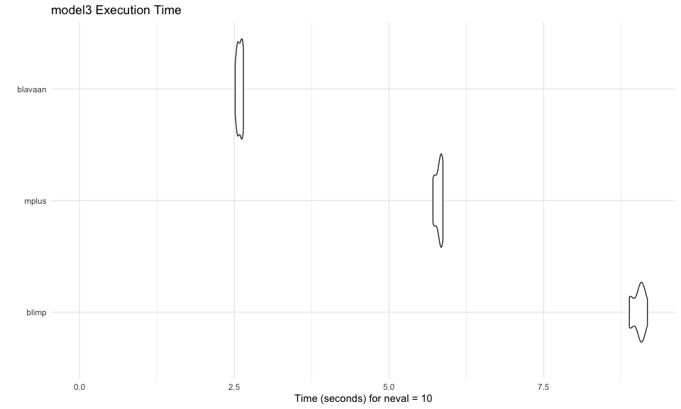<!-- -->

------------------------------------------------------------------------

## MODEL5

### Summary Statistics

<table class="table table-striped table-hover table-condensed" style="width: auto !important; margin-left: auto; margin-right: auto;">

<caption>

model5 summary
</caption>

<thead>

<tr>

<th style="text-align:left;">

expr
</th>

<th style="text-align:right;">

min
</th>

<th style="text-align:right;">

lq
</th>

<th style="text-align:right;">

mean
</th>

<th style="text-align:right;">

median
</th>

<th style="text-align:right;">

uq
</th>

<th style="text-align:right;">

max
</th>

<th style="text-align:right;">

neval
</th>

</tr>

</thead>

<tbody>

<tr>

<td style="text-align:left;">

blimp
</td>

<td style="text-align:right;">

29.65
</td>

<td style="text-align:right;">

29.84
</td>

<td style="text-align:right;">

30.13
</td>

<td style="text-align:right;">

30.06
</td>

<td style="text-align:right;">

30.44
</td>

<td style="text-align:right;">

30.86
</td>

<td style="text-align:right;">

10
</td>

</tr>

<tr>

<td style="text-align:left;">

mplus
</td>

<td style="text-align:right;">

80.87
</td>

<td style="text-align:right;">

81.10
</td>

<td style="text-align:right;">

81.38
</td>

<td style="text-align:right;">

81.38
</td>

<td style="text-align:right;">

81.52
</td>

<td style="text-align:right;">

82.27
</td>

<td style="text-align:right;">

10
</td>

</tr>

<tr>

<td style="text-align:left;">

blavaan
</td>

<td style="text-align:right;">

104.56
</td>

<td style="text-align:right;">

107.96
</td>

<td style="text-align:right;">

125.36
</td>

<td style="text-align:right;">

133.46
</td>

<td style="text-align:right;">

139.15
</td>

<td style="text-align:right;">

139.70
</td>

<td style="text-align:right;">

10
</td>

</tr>

</tbody>

</table>

### Distribution Plot

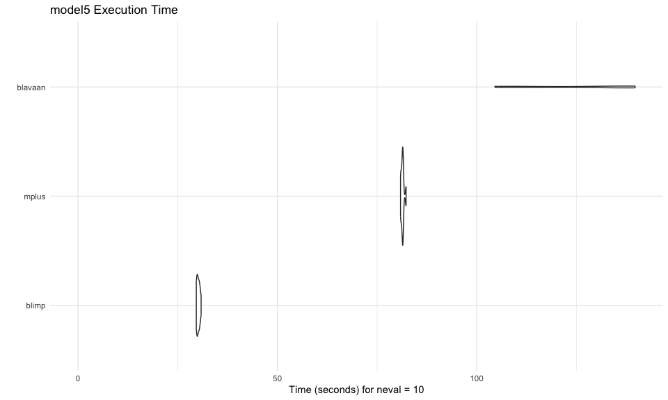<!-- -->

------------------------------------------------------------------------

## MODEL6

### Summary Statistics

<table class="table table-striped table-hover table-condensed" style="width: auto !important; margin-left: auto; margin-right: auto;">

<caption>

model6 summary
</caption>

<thead>

<tr>

<th style="text-align:left;">

expr
</th>

<th style="text-align:right;">

min
</th>

<th style="text-align:right;">

lq
</th>

<th style="text-align:right;">

mean
</th>

<th style="text-align:right;">

median
</th>

<th style="text-align:right;">

uq
</th>

<th style="text-align:right;">

max
</th>

<th style="text-align:right;">

neval
</th>

</tr>

</thead>

<tbody>

<tr>

<td style="text-align:left;">

blimp
</td>

<td style="text-align:right;">

12.60
</td>

<td style="text-align:right;">

12.68
</td>

<td style="text-align:right;">

12.76
</td>

<td style="text-align:right;">

12.74
</td>

<td style="text-align:right;">

12.81
</td>

<td style="text-align:right;">

13.10
</td>

<td style="text-align:right;">

10
</td>

</tr>

<tr>

<td style="text-align:left;">

mplus
</td>

<td style="text-align:right;">

36.54
</td>

<td style="text-align:right;">

36.86
</td>

<td style="text-align:right;">

37.07
</td>

<td style="text-align:right;">

36.95
</td>

<td style="text-align:right;">

37.31
</td>

<td style="text-align:right;">

37.69
</td>

<td style="text-align:right;">

10
</td>

</tr>

<tr>

<td style="text-align:left;">

blavaan
</td>

<td style="text-align:right;">

115.70
</td>

<td style="text-align:right;">

116.55
</td>

<td style="text-align:right;">

117.69
</td>

<td style="text-align:right;">

116.82
</td>

<td style="text-align:right;">

119.31
</td>

<td style="text-align:right;">

120.38
</td>

<td style="text-align:right;">

10
</td>

</tr>

</tbody>

</table>

### Distribution Plot

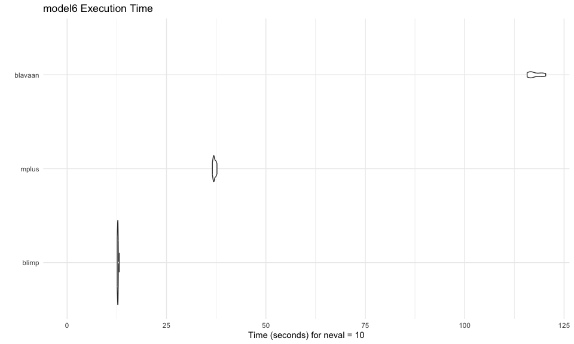<!-- -->

------------------------------------------------------------------------

## MODEL13

### Summary Statistics

<table class="table table-striped table-hover table-condensed" style="width: auto !important; margin-left: auto; margin-right: auto;">

<caption>

model13 summary
</caption>

<thead>

<tr>

<th style="text-align:left;">

expr
</th>

<th style="text-align:right;">

min
</th>

<th style="text-align:right;">

lq
</th>

<th style="text-align:right;">

mean
</th>

<th style="text-align:right;">

median
</th>

<th style="text-align:right;">

uq
</th>

<th style="text-align:right;">

max
</th>

<th style="text-align:right;">

neval
</th>

</tr>

</thead>

<tbody>

<tr>

<td style="text-align:left;">

blimp
</td>

<td style="text-align:right;">

20.85
</td>

<td style="text-align:right;">

20.92
</td>

<td style="text-align:right;">

21.11
</td>

<td style="text-align:right;">

20.97
</td>

<td style="text-align:right;">

21.36
</td>

<td style="text-align:right;">

21.75
</td>

<td style="text-align:right;">

10
</td>

</tr>

<tr>

<td style="text-align:left;">

mplus
</td>

<td style="text-align:right;">

17.53
</td>

<td style="text-align:right;">

17.58
</td>

<td style="text-align:right;">

17.71
</td>

<td style="text-align:right;">

17.69
</td>

<td style="text-align:right;">

17.82
</td>

<td style="text-align:right;">

17.96
</td>

<td style="text-align:right;">

10
</td>

</tr>

</tbody>

</table>

### Distribution Plot

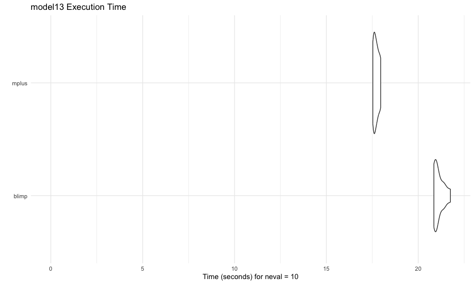<!-- -->

------------------------------------------------------------------------

## MODEL14

### Summary Statistics

<table class="table table-striped table-hover table-condensed" style="width: auto !important; margin-left: auto; margin-right: auto;">

<caption>

model14 summary
</caption>

<thead>

<tr>

<th style="text-align:left;">

expr
</th>

<th style="text-align:right;">

min
</th>

<th style="text-align:right;">

lq
</th>

<th style="text-align:right;">

mean
</th>

<th style="text-align:right;">

median
</th>

<th style="text-align:right;">

uq
</th>

<th style="text-align:right;">

max
</th>

<th style="text-align:right;">

neval
</th>

</tr>

</thead>

<tbody>

<tr>

<td style="text-align:left;">

blimp
</td>

<td style="text-align:right;">

1.79
</td>

<td style="text-align:right;">

1.81
</td>

<td style="text-align:right;">

1.82
</td>

<td style="text-align:right;">

1.82
</td>

<td style="text-align:right;">

1.84
</td>

<td style="text-align:right;">

1.86
</td>

<td style="text-align:right;">

10
</td>

</tr>

<tr>

<td style="text-align:left;">

mplus
</td>

<td style="text-align:right;">

0.95
</td>

<td style="text-align:right;">

0.96
</td>

<td style="text-align:right;">

0.97
</td>

<td style="text-align:right;">

0.98
</td>

<td style="text-align:right;">

0.98
</td>

<td style="text-align:right;">

0.98
</td>

<td style="text-align:right;">

10
</td>

</tr>

<tr>

<td style="text-align:left;">

blavaan
</td>

<td style="text-align:right;">

1.41
</td>

<td style="text-align:right;">

1.43
</td>

<td style="text-align:right;">

1.47
</td>

<td style="text-align:right;">

1.45
</td>

<td style="text-align:right;">

1.51
</td>

<td style="text-align:right;">

1.56
</td>

<td style="text-align:right;">

10
</td>

</tr>

</tbody>

</table>

### Distribution Plot

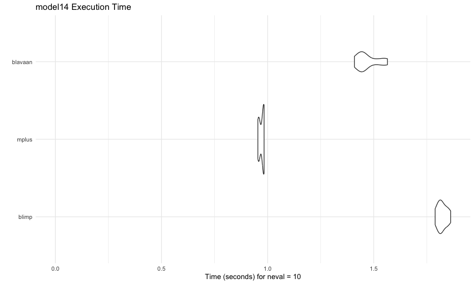<!-- -->

------------------------------------------------------------------------

## MODEL17

### Summary Statistics

<table class="table table-striped table-hover table-condensed" style="width: auto !important; margin-left: auto; margin-right: auto;">

<caption>

model17 summary
</caption>

<thead>

<tr>

<th style="text-align:left;">

expr
</th>

<th style="text-align:right;">

min
</th>

<th style="text-align:right;">

lq
</th>

<th style="text-align:right;">

mean
</th>

<th style="text-align:right;">

median
</th>

<th style="text-align:right;">

uq
</th>

<th style="text-align:right;">

max
</th>

<th style="text-align:right;">

neval
</th>

</tr>

</thead>

<tbody>

<tr>

<td style="text-align:left;">

blimp
</td>

<td style="text-align:right;">

15.91
</td>

<td style="text-align:right;">

15.97
</td>

<td style="text-align:right;">

16.10
</td>

<td style="text-align:right;">

16.09
</td>

<td style="text-align:right;">

16.22
</td>

<td style="text-align:right;">

16.26
</td>

<td style="text-align:right;">

10
</td>

</tr>

<tr>

<td style="text-align:left;">

mplus
</td>

<td style="text-align:right;">

164.80
</td>

<td style="text-align:right;">

165.51
</td>

<td style="text-align:right;">

165.81
</td>

<td style="text-align:right;">

165.82
</td>

<td style="text-align:right;">

166.06
</td>

<td style="text-align:right;">

167.10
</td>

<td style="text-align:right;">

10
</td>

</tr>

</tbody>

</table>

### Distribution Plot

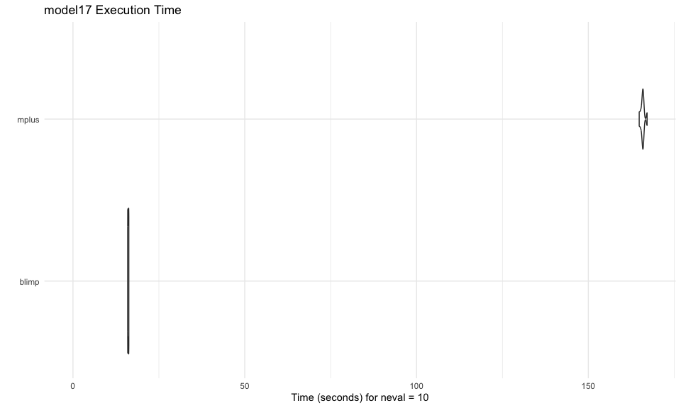<!-- -->

------------------------------------------------------------------------

## MODEL20

### Summary Statistics

<table class="table table-striped table-hover table-condensed" style="width: auto !important; margin-left: auto; margin-right: auto;">

<caption>

model20 summary
</caption>

<thead>

<tr>

<th style="text-align:left;">

expr
</th>

<th style="text-align:right;">

min
</th>

<th style="text-align:right;">

lq
</th>

<th style="text-align:right;">

mean
</th>

<th style="text-align:right;">

median
</th>

<th style="text-align:right;">

uq
</th>

<th style="text-align:right;">

max
</th>

<th style="text-align:right;">

neval
</th>

</tr>

</thead>

<tbody>

<tr>

<td style="text-align:left;">

blimp
</td>

<td style="text-align:right;">

15.12
</td>

<td style="text-align:right;">

15.15
</td>

<td style="text-align:right;">

15.26
</td>

<td style="text-align:right;">

15.26
</td>

<td style="text-align:right;">

15.31
</td>

<td style="text-align:right;">

15.53
</td>

<td style="text-align:right;">

10
</td>

</tr>

<tr>

<td style="text-align:left;">

blavaan
</td>

<td style="text-align:right;">

112.62
</td>

<td style="text-align:right;">

113.72
</td>

<td style="text-align:right;">

117.59
</td>

<td style="text-align:right;">

115.01
</td>

<td style="text-align:right;">

116.78
</td>

<td style="text-align:right;">

141.86
</td>

<td style="text-align:right;">

10
</td>

</tr>

</tbody>

</table>

### Distribution Plot

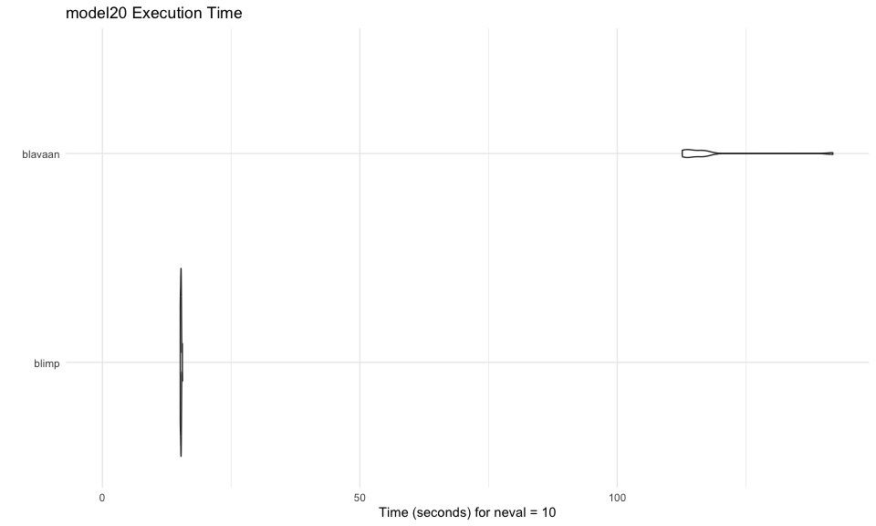<!-- -->

------------------------------------------------------------------------

## MODEL21

### Summary Statistics

<table class="table table-striped table-hover table-condensed" style="width: auto !important; margin-left: auto; margin-right: auto;">

<caption>

model21 summary
</caption>

<thead>

<tr>

<th style="text-align:left;">

expr
</th>

<th style="text-align:right;">

min
</th>

<th style="text-align:right;">

lq
</th>

<th style="text-align:right;">

mean
</th>

<th style="text-align:right;">

median
</th>

<th style="text-align:right;">

uq
</th>

<th style="text-align:right;">

max
</th>

<th style="text-align:right;">

neval
</th>

</tr>

</thead>

<tbody>

<tr>

<td style="text-align:left;">

blimp
</td>

<td style="text-align:right;">

47.52
</td>

<td style="text-align:right;">

47.55
</td>

<td style="text-align:right;">

48.79
</td>

<td style="text-align:right;">

47.98
</td>

<td style="text-align:right;">

49.58
</td>

<td style="text-align:right;">

52.26
</td>

<td style="text-align:right;">

10
</td>

</tr>

<tr>

<td style="text-align:left;">

mplus
</td>

<td style="text-align:right;">

20.12
</td>

<td style="text-align:right;">

20.32
</td>

<td style="text-align:right;">

20.50
</td>

<td style="text-align:right;">

20.43
</td>

<td style="text-align:right;">

20.83
</td>

<td style="text-align:right;">

20.92
</td>

<td style="text-align:right;">

10
</td>

</tr>

</tbody>

</table>

### Distribution Plot

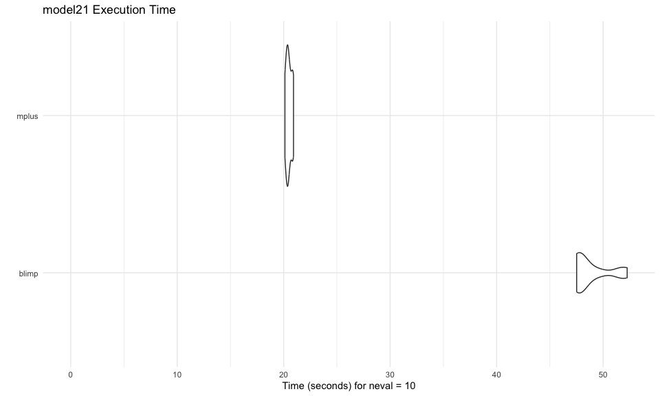<!-- -->

------------------------------------------------------------------------

# System Information

- **Computer:** MacBook Pro
- **Chip:** Apple M2 Max
- **Memory:** 64 GB
- **OS:** macOS 26.0.1

# Benchmark Session Information

**Benchmark Run Date:** 2025-10-10 10:38:25 CDT

## Software Versions

- **Blimp:** Not found
- **blavaan:** 0.5.9
- **Mplus:** Not found

## R Session Information

``` r
if (!is.null(benchmark_session_info)) {
  print(benchmark_session_info)
} else {
  cat("Session information not available. Please re-run benchmark.R to capture session info.\n")
}
```

    ## R version 4.5.1 (2025-06-13)
    ## Platform: aarch64-apple-darwin20
    ## Running under: macOS Tahoe 26.0.1
    ## 
    ## Matrix products: default
    ## BLAS:   /Library/Frameworks/R.framework/Versions/4.5-arm64/Resources/lib/libRblas.0.dylib 
    ## LAPACK: /Library/Frameworks/R.framework/Versions/4.5-arm64/Resources/lib/libRlapack.dylib;  LAPACK version 3.12.1
    ## 
    ## locale:
    ## [1] en_US.UTF-8/en_US.UTF-8/en_US.UTF-8/C/en_US.UTF-8/en_US.UTF-8
    ## 
    ## time zone: America/Chicago
    ## tzcode source: internal
    ## 
    ## attached base packages:
    ## [1] stats     graphics  grDevices utils     datasets  methods   base     
    ## 
    ## other attached packages:
    ## [1] microbenchmark_1.5.0 rstan_2.32.7         StanHeaders_2.32.10 
    ## [4] blavaan_0.5-8        Rcpp_1.1.0           lavaan_0.6-19       
    ## [7] MplusAutomation_1.2  rblimp_0.2.38       
    ## 
    ## loaded via a namespace (and not attached):
    ##  [1] gtable_0.3.6          xfun_0.53             ggplot2_3.5.2        
    ##  [4] QuickJSR_1.8.0        inline_0.3.21         CompQuadForm_1.4.4   
    ##  [7] lattice_0.22-7        quadprog_1.5-8        vctrs_0.6.5          
    ## [10] tools_4.5.1           generics_0.1.4        stats4_4.5.1         
    ## [13] parallel_4.5.1        sandwich_3.1-1        tibble_3.3.0         
    ## [16] pkgconfig_2.0.3       proto_1.0.0           Matrix_1.7-3         
    ## [19] data.table_1.17.8     checkmate_2.3.3       RColorBrewer_1.1-3   
    ## [22] RcppParallel_5.1.11-1 lifecycle_1.0.4       tmvnsim_1.0-2        
    ## [25] stringr_1.5.2         compiler_4.5.1        farver_2.1.2         
    ## [28] textshaping_1.0.3     mnormt_2.1.1          codetools_0.2-20     
    ## [31] htmltools_0.5.8.1     bayesplot_1.14.0      pillar_1.11.0        
    ## [34] tidyr_1.3.1           gsubfn_0.7            boot_1.3-31          
    ## [37] parallelly_1.45.1     tidyselect_1.2.1      digest_0.6.37        
    ## [40] stringi_1.8.7         mvtnorm_1.3-3         future_1.67.0        
    ## [43] purrr_1.1.0           nonnest2_0.5-8        dplyr_1.1.4          
    ## [46] pander_0.6.6          listenv_0.9.1         fastmap_1.2.0        
    ## [49] grid_4.5.1            cli_3.6.5             magrittr_2.0.3       
    ## [52] loo_2.8.0             fastDummies_1.7.5     pkgbuild_1.4.8       
    ## [55] future.apply_1.20.0   pbivnorm_0.6.0        scales_1.4.0         
    ## [58] backports_1.5.0       rmarkdown_2.29        httr_1.4.7           
    ## [61] matrixStats_1.5.0     globals_0.18.0        gridExtra_2.3        
    ## [64] zoo_1.8-14            kableExtra_1.4.0      evaluate_1.0.5       
    ## [67] coda_0.19-4.1         knitr_1.50            viridisLite_0.4.2    
    ## [70] rstantools_2.5.0      rlang_1.1.6           xtable_1.8-4         
    ## [73] glue_1.8.0            xml2_1.4.0            svglite_2.2.1        
    ## [76] rstudioapi_0.17.1     R6_2.6.1              plyr_1.8.9           
    ## [79] systemfonts_1.2.3     texreg_1.39.4

------------------------------------------------------------------------

**Note:** This report was automatically generated using the
`microbenchmark` package with 10 replications per software package per
model.
